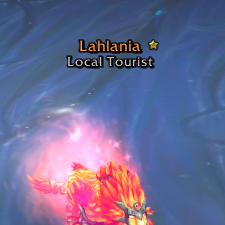
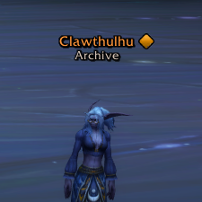

# Kui Nameplates Friend Highlight
## Retired
*Due to restrictions Blizzard has put on adding custom information to nameplates in World of Warcraft Midnight—and [Kui Nameplates as a whole not being developed going forward](https://github.com/kesava-wow/kuinameplates2/issues/780#issuecomment-3765893297)—this addon is no longer being developed.*

## Description
Add an icon next to your friends and guildmates' nameplates with this plugin for [KuiNameplates](https://www.curseforge.com/wow/addons/kuinameplates).

Note that [KuiNameplates](https://www.curseforge.com/wow/addons/kuinameplates) must be installed and running for this plugin to work.

## Author
Created by Peter Wooley